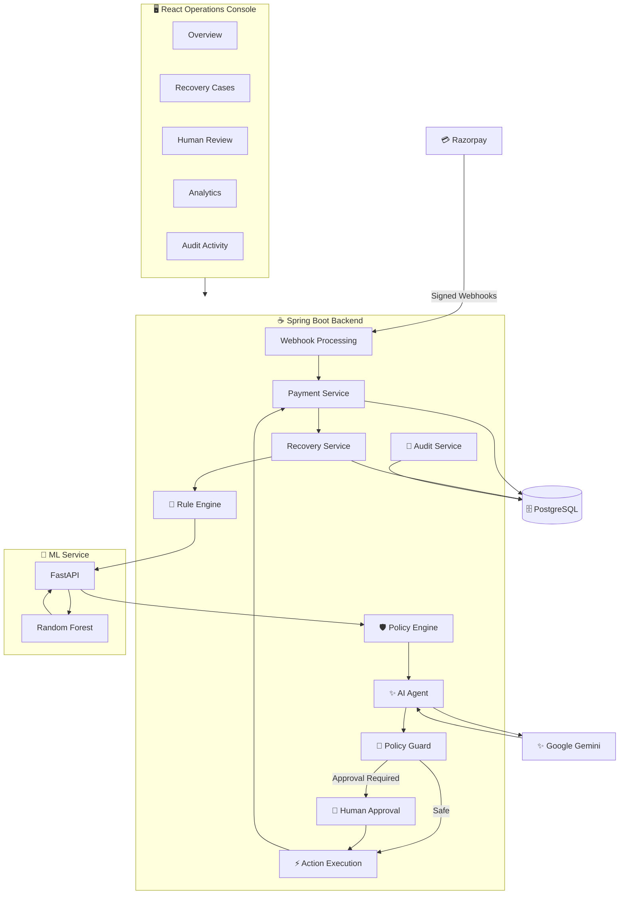
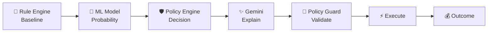
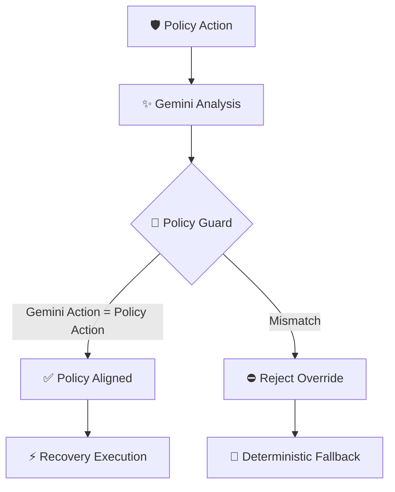
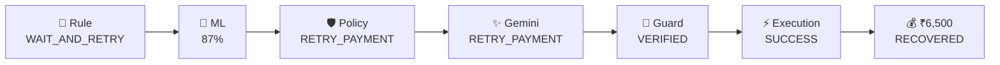
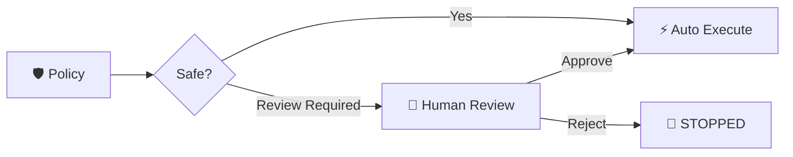

# 🚀 RecoverAI

> **AI-powered, policy-governed revenue recovery for failed payments.**

RecoverAI transforms failed payments into **intelligent, explainable, and safely executable recovery workflows**.

Instead of blindly retrying every failed transaction, RecoverAI combines a deterministic **Rule Engine**, **ML-based recovery probability**, a **Policy Engine**, **Gemini-powered analysis**, a **Policy Guard**, automated recovery execution, human approval, analytics, and complete auditability.

---

## 🌐 Live Demo

- **Frontend:** https://recover-ai-xi-plum.vercel.app/
- **Backend API:** https://recoverai-api-0a22.onrender.com
- **ML Service:** https://recoverai-ml-ht3b.onrender.com

> **Try the live application:** Open the frontend dashboard to explore the complete AI-powered revenue recovery workflow.

> **Note:** Backend and ML services are hosted on Render and may take a short time to wake up after inactivity.

---

## 💡 The Problem

Payment failures directly impact merchant revenue.

Traditional recovery systems often rely on static retry logic:

```text
Payment Failed → Wait → Retry → Retry Again
```

But every failed payment is different.

A temporary network failure on a high-recovery-probability payment should not necessarily receive the same treatment as a repeatedly declined, high-value payment.

RecoverAI asks:

- 🧠 How likely is this payment to recover?
- ⚙️ What recovery strategy should be used?
- 🛡️ Is that action safe to execute automatically?
- 👤 Does it require human approval?
- 💰 Was the revenue actually recovered?
- 📜 Why was each decision made?

---

## ✨ What RecoverAI Does

```text
Payment Failure
      ↓
Rule-Based Baseline
      ↓
ML Recovery Probability
      ↓
Policy Decision
      ↓
Gemini Diagnosis & Explanation
      ↓
Policy Guard
      ↓
Recovery Execution / Human Review
      ↓
Payment Captured
      ↓
Revenue Recovered
      ↓
Analytics + Audit Trail
```

### Key Features

- 💳 Razorpay webhook integration with signature verification
- 🧩 Deterministic recovery Rule Engine
- 🧠 ML-based recovery probability scoring
- 🛡️ Policy-controlled recovery decisions
- ✨ Gemini-powered diagnosis and explanations
- 🔐 Guard against AI overriding policy
- ⚡ Recovery action execution
- 👤 Human-in-the-loop approval
- 🔁 Maximum-attempt and terminal-state safeguards
- 💰 Recovered revenue measurement
- 📊 Recovery analytics
- 📜 End-to-end audit trail
- 🧯 ML and Gemini failure fallbacks

---

# 🏗️ Architecture



---

# 🧠 Decision Intelligence

RecoverAI deliberately separates **prediction, decision-making, AI reasoning, and execution**.



### 🧩 Rule Engine

Creates a deterministic recovery baseline using:

- failure reason
- payment amount
- attempt count
- recovery priority

Example:

```text
NETWORK_ERROR + First Attempt
        ↓
WAIT_AND_RETRY
```

### 🧠 ML Model

A Python FastAPI service uses a **Random Forest classifier** to estimate recovery probability.

Example:

```text
Recovery Probability → 87%
```

The current buildathon model uses **synthetically generated recovery data** for prototyping.

In production, it would be retrained using real merchant historical payment and recovery outcomes.

### 🛡️ Policy Engine

The ML model predicts probability — it does **not** directly decide what gets executed.

The deterministic Policy Engine combines the baseline, ML probability, amount, attempts, and failure context to choose the permitted recovery strategy.

Example:

```text
Rule Baseline       → WAIT_AND_RETRY
ML Probability      → 87%
Policy Decision     → RETRY_PAYMENT
```

### ✨ Gemini Recovery Agent

Gemini provides:

- failure diagnosis
- business explanation
- confidence
- recommended next steps
- policy-aligned proposed action

Gemini does **not** independently control recovery execution.

---

# 🔐 Policy-Constrained AI

A core RecoverAI safety principle is:

> **The LLM does not directly control recovery actions.**

The Policy Engine first selects the safe action. Gemini then diagnoses and explains the decision within that boundary.



The fundamental guard condition is:

```text
Gemini Proposed Action == Policy Approved Action
```

This prevents an LLM hallucination from silently changing an operational recovery decision.

---

# 🏆 Demo Recovery — Case #32

A complete RecoverAI recovery lifecycle was tested using:

```text
Payment ID     : pay_final_demo_001
Amount         : ₹6,500
Failure Reason : NETWORK_ERROR
```

The intelligence pipeline produced:



### Decision Delta

```text
Rule Baseline
WAIT_AND_RETRY
       ↓
ML Recovery Probability
87%
       ↓
Recovery Strategy
RETRY_PAYMENT
       ↓
Outcome
₹6,500 RECOVERED
```

This demonstrates one of RecoverAI's main differentiators:

> **The system can compare the deterministic baseline with the intelligent recovery strategy and measure the resulting business outcome.**

---

# 👤 Human-in-the-Loop

Risky recovery cases can be prevented from automatically executing.



Human approvals and rejections are also recorded in the audit trail.

---

# 🛡️ Recovery Safety

RecoverAI includes multiple operational safeguards:

- 🔏 Razorpay webhook signature verification
- 🔁 Duplicate webhook protection
- 🧱 Payment state idempotency
- ↔️ Out-of-order webhook protection
- 🔐 Policy-constrained AI
- 👤 Human approval boundaries
- 🔁 Maximum recovery attempts
- 🛑 Terminal-state execution protection
- 📜 Complete decision auditability

Recovery execution is stopped after the configured maximum attempt boundary, preventing uncontrolled retry loops.

---

# 🧯 Fault Tolerance

AI services improve RecoverAI, but the core recovery system does not depend on them to remain operational.

### If ML is unavailable

```text
Rule Engine
    ↓
Policy Fallback
    ↓
Deterministic Recovery Flow
```

### If Gemini is unavailable

```text
Policy Decision
    ↓
Deterministic Agent Fallback
    ↓
Recovery Flow Continues
```

> **AI should improve recovery intelligence, not become a dependency that prevents recovery.**

---

# 💰 Recovery Analytics

RecoverAI measures actual business outcomes, including:

- Total revenue at risk
- Recovered revenue
- Outstanding revenue
- Recovery rate
- Open / recovered / stopped cases
- ML-scored cases
- Decision changes
- Successful / failed executions
- Failure reason distribution
- Priority distribution
- Rule baseline vs final action distribution

### Current Demo Metrics

| Metric | Value |
|---|---:|
| 💰 Recovered Revenue | **₹22,498** |
| 💳 Revenue at Risk | **₹2,33,994** |
| ⚠️ Outstanding Revenue | **₹2,11,496** |
| 📈 Recovery Rate | **9.61%** |
| 🧠 ML Scored Cases | **13** |
| 🔀 Decision Changes | **9** |
| ⚡ Successful Executions | **7** |
| ❌ Failed Executions | **0** |

---

# 📜 Auditability

RecoverAI maintains an audit trail across the complete recovery lifecycle:

```text
Payment Failed
      ↓
Recovery Case Created
      ↓
Rule Recommendation
      ↓
ML Prediction
      ↓
Policy Decision
      ↓
Gemini Analysis
      ↓
Recovery Execution
      ↓
Payment Captured
      ↓
Revenue Recovered
```

This makes it possible to answer:

> **What happened, who/what made the decision, why did it happen, and what was the final outcome?**

---

## 📊 Production Demo Results

RecoverAI has been deployed and tested through the complete recovery lifecycle.

A production demo scenario processed two failed payments with a combined revenue at risk of **₹13,000**.

For one ₹6,500 network-error payment:

- Rule Engine recommended `WAIT_AND_RETRY`
- ML predicted an **87% recovery probability**
- Policy Engine selected `RETRY_PAYMENT`
- Gemini generated the recovery diagnosis and explanation
- Policy Guard verified the AI response
- Recovery action was successfully executed
- A signed `payment.captured` event completed the payment lifecycle
- The recovery case was marked `RECOVERED`

### Result

| Metric | Value |
|---|---:|
| Total Revenue at Risk | ₹13,000 |
| Recovered Revenue | ₹6,500 |
| Outstanding Revenue | ₹6,500 |
| Recovery Rate | 50% |
| ML Scored Cases | 2 |
| Successful Recovery Execution | 1 |

This demonstrates the complete flow from **payment failure → intelligent decision → governed execution → payment capture → measurable recovered revenue**.

---


# 🧰 Tech Stack

| Layer | Technologies |
|---|---|
| 🖥️ Frontend | React, JavaScript/JSX, Vite |
| 🎨 UI | Recharts, Framer Motion, Lucide |
| ☕ Backend | Java, Spring Boot, Spring Data JPA |
| 🗄️ Database | PostgreSQL |
| 🧠 ML | Python, FastAPI, scikit-learn, Random Forest |
| ✨ Generative AI | Google Gemini |
| 💳 Payments | Razorpay |
| 🌐 API Communication | REST, Axios |

---

# 📂 Project Structure

```text
RecoverAi/
│
├── src/                    # Spring Boot backend
│
├── ml/                     # ML microservice
│   ├── app.py
│   ├── generate_dataset.py
│   ├── train_model.py
│   ├── recovery_model.pkl
│   └── requirements.txt
│
├── Frontend/               # React operations console
│   ├── src/
│   ├── package.json
│   └── vite.config.js
│
├── pom.xml
└── README.md
```

---

# 🚀 Running Locally

RecoverAI uses four main components:

```text
PostgreSQL      → 5432
ML Service      → 8000
Spring Boot API → 8080
React Frontend  → 5173
```

### 1️⃣ Start PostgreSQL

Create the database:

```sql
CREATE DATABASE recoverai;
```

Configure the Spring datasource credentials locally.

### 2️⃣ Start ML Service

```bash
cd ml
python -m venv venv
```

Activate the virtual environment and install dependencies:

```bash
pip install -r requirements.txt
```

Run:

```bash
python -m uvicorn app:app --host 127.0.0.1 --port 8000
```

### 3️⃣ Start Spring Boot

Run the Spring Boot application.

```text
http://localhost:8080
```

### 4️⃣ Start Frontend

```bash
cd Frontend
npm install
npm run dev
```

Open:

```text
http://localhost:5173
```

---

# 🔑 Configuration

RecoverAI requires local configuration for:

```text
PostgreSQL credentials
Razorpay API credentials
Razorpay webhook secret
Gemini API key
ML service URL
```

⚠️ **Never commit API keys, webhook secrets, passwords, or `.env` files to Git.**

For local Razorpay webhook testing, the Spring Boot webhook endpoint can be exposed using a tunnel such as ngrok.

---

# ⚠️ Buildathon Scope

RecoverAI is a functional buildathon prototype focused on the **revenue recovery intelligence pipeline**.

The ML model currently uses synthetic training data. A production implementation would train on merchant historical recovery outcomes.

Operator authentication is also outside the current buildathon scope. A production deployment would protect operator APIs using **Spring Security + RBAC**, separating roles such as:

```text
VIEWER
OPERATIONS
REVIEWER
ADMIN
```

Other production extensions could include merchant isolation, real communication providers, scheduled retry orchestration, message queues, model monitoring, distributed tracing, and production observability.

---

# 🎯 Why RecoverAI?

Most payment systems can answer:

```text
"Did the payment fail?"
```

RecoverAI goes further:

```text
Why did it fail?
        ↓
How likely is recovery?
        ↓
What should we do next?
        ↓
Is that action safe?
        ↓
Can it execute automatically?
        ↓
Did we recover the payment?
        ↓
How much revenue came back?
        ↓
Why was every decision made?
```

---

## 🚀 RecoverAI

### **From failed payments to governed, intelligent revenue recovery.**

Built for the **AI Revenue Recovery** track.